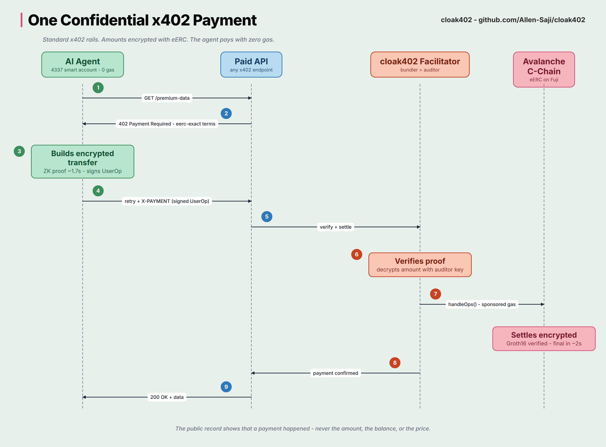

# cloak402

Confidential x402 payments on Avalanche.

x402 lets clients and AI agents pay for HTTP APIs per request. Today every x402 payment on Avalanche settles as a plain USDC transfer: anyone watching the chain can see which services an agent uses, how often, and how much it spends. cloak402 keeps the rails and hides the numbers.

Payments settle through eERC (Encrypted ERC), AvaCloud's confidential token standard. Balances and transfer amounts stay encrypted on-chain under ElGamal + zk-SNARKs (Groth16). A rotatable auditor key gives compliance-grade visibility to exactly one designated party and nobody else.

## How it works



- The agent's wallet is an ERC-4337 smart account. eERC binds transfers to msg.sender, so the account submits its own transfer through the EntryPoint while the facilitator sponsors gas. The agent never needs AVAX.
- The facilitator implements a custom x402 v2 scheme, [`eerc-exact`](docs/eerc-exact.md), registered for `eip155:43113` (Fuji). It verifies the zk proof against the payer's live balance ciphertext, decrypts the in-proof auditor ciphertext to confirm the exact amount, and self-bundles settlement via `entryPoint.handleOps` -- no external bundler or paymaster service.
- Amounts are hidden from the public chain. The auditor role is held by the facilitator by default, or self-hosted by the API server for full privacy.

## Packages

| Package | Purpose |
|---|---|
| `packages/eerc` | eERC crypto core: key derivation, PCT encryption, transfer proofs, 4337 UserOp helpers |
| `packages/facilitator` | x402 facilitator with the `eerc-exact` scheme (verify + settle) and HTTP app |
| `packages/client` | Agent-side SDK: CloakAgent, x402 scheme client, payment-enabled fetch |
| `packages/server-demo` | Demo paid API using the `eerc-exact` scheme via @x402/express |
| `packages/demo` | Fuji end-to-end demo: setup script and a paying agent |
| `vendor/EncryptedERC` | Pinned fork of ava-labs/EncryptedERC with Fuji deploy config and zk artifacts |

Built on the x402 v2 packages (`@x402/core`, `@x402/express`, `@x402/fetch`): `eerc-exact` plugs in as a scheme registration, without forking the protocol.

## Quickstart (Fuji)

Prerequisites: Node 22, pnpm 9, a funded Fuji key that owns the deployed eERC stack.

```bash
git clone --recurse-submodules https://github.com/Allen-Saji/cloak402
cd cloak402 && pnpm install

export FACILITATOR_PRIVATE_KEY=0x...   # operator key (gas + auditor)

# one-time: rotate the eERC auditor to the facilitator's derived key,
# register a seller and the agent's smart account, fund its encrypted balance
pnpm --filter @cloak402/demo run setup

# terminal 1: facilitator
pnpm --filter @cloak402/facilitator start

# terminal 2: demo API (PAY_TO = seller address printed by setup)
PAY_TO=0x... pnpm --filter @cloak402/server-demo start

# terminal 3: the paying agent
pnpm --filter @cloak402/demo agent
```

The agent hits `GET /api/alpha`, receives a 402 with `eerc-exact` terms, proves an encrypted transfer of exactly the required amount, retries with the payment header, and gets the resource plus the settlement transaction hash. Amounts on Snowtrace are ciphertexts.

## Verified on Fuji

- eERC converter stack with audited prod verifiers: [contract on Snowtrace](https://testnet.snowtrace.io/address/0x2A60EF46E6D65580144c734592AA8D163A97EFdd)
- Gasless 4337 leg (smart account pays, owner EOA holds zero gas): [`0x04732f48...`](https://testnet.snowtrace.io/tx/0x04732f489e4610bd2cb35529137570412a0d63d895591d29e97c8586d9c2eef6)
- Full x402 paid request through the facilitator: [`0x22fa036a...`](https://testnet.snowtrace.io/tx/0x22fa036ae2bccbb35a578cad1540f91b44eadefe6a7c1dee805e8b2b7f629964)

## Threat model

- **Facilitator as auditor.** Amounts are hidden from the public chain, not from the facilitator: its rotatable auditor key decrypts every payment in its scheme. That is the compliance feature, and the trust tradeoff is explicit. Full-privacy deployments self-host the facilitator next to the API server so no third party sees amounts.
- **Replay and tampering.** Transfer proofs commit to the sender's exact current balance ciphertext, the receiver, the amount, and the auditor ciphertext. A settled proof no longer matches the live ciphertext, so every payload is single-use; nothing in it can be altered by a relayer.
- **Concurrency.** Two in-flight payments from one account would race on the balance ciphertext; the facilitator serializes settlement per sender (single-instance; multi-instance deployments need a shared lock).
- **Withheld proofs.** The circuit has no deadline, so an unsettled proof stays valid until the sender's balance ciphertext next changes. The facilitator settles immediately after verify; a sender can invalidate an outstanding proof with any self-transfer. A deadline signal needs an upstream circuit change (proposed as future work).
- **Gas sponsorship.** The facilitator tops up the payer's EntryPoint deposit. Sponsorship happens only after full payment verification, bounding griefing to verified-but-unsettleable edge cases.
- **Key derivation.** The agent's BabyJubJub key is derived from its owner EOA's signature; whoever controls the owner EOA controls the encrypted balance.

## Status

Built for the Team1 India Speedrun: Privacy on Avalanche (July 2026). Testnet (Fuji) only. Not audited beyond the upstream eERC audit; do not use with real funds.

## Prior art

cloak402 ports the idea behind [px402](https://px402.allensaji.dev) (private x402 on Solana / MagicBlock private ephemeral rollups) to the Avalanche stack.

## License

MIT
